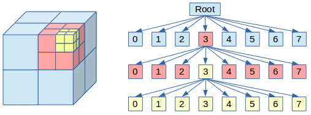

# TRIANGLES_IN_SPACE

## Оптимизация

Заметим, что наивный алгоритм определения пересечений треугольников работает слишком долго, а именно за $O(N^2)$.
```
for (std::size_t i = 0; i < N; ++i)
    for (std::size_t j = i + 1; j < N; ++j)
        if (check_intersection (array_triangle[i], array_triangle[j]))
        {
            triangle_num.insert (i);
            triangle_num.insert (j);
        }
```
Попробуем снизить число проверок треугольников на пересечение, которые гарантированно не могут пересекаться.

### Octree

За основу возьмем Octree.



Рис. 1.

Его идея состоит в том что мы рекурсивно бьем пространство на меньшие подпространства, тем самым треугольники из разных подпространств проверять уже не нужно, таким образом мы улучшаем нашу асимптотику. 

### Построение и обработка

Для начала нужно определить область пространства, в которой лежат все треугольники. Выберем такой куб со стороной равной степени 2, и симметричный относительно начала координат, в который помещаются все треугольники. Начнем рекурсивное разбиение полученного ограниченного пространства относительно центра куба: первое разбиение относительно точки $O(0,0,0)$, т.е. получается 8 октав и так далее.

При рекурсивном построении дерева условия выхода из рекурсии:
1. Треугольников в подпространстве не более 15
2. Глубина рекурсии более 6

Теперь к деталям: что делать с теми треугольниками, которые при разбиении попадают в несколько подпространств. Их можно оставлять в текущем узле (из которого началось разбиение), либо копировать во все подпространства, с которыми они пересекаются.

При 1 подходе каждый треугольник в дереве уникален, но возникают сложности при проверке пересечений. Ведь если мы оставили треугольники в узле (не лист), то необходимо проверить их со всеми детьми и их детьми и тд. То есть при рекурсивном обходе дерева, мы обязаны поддерживать актуальный список всех встретившихся треугольников, пока не дойдем до листа. 

При 2 подходе все треугольники уже находятся в листах, те которые были на границах (дублируются в нескольких листах). При такой структуре нам не нужно поддерживать актуальный список треугольников с верхних ярусов, достаточно при рекурсии в каждом листе проверять треугольники на их взаимное пересечение. Но, если вся необходимая информация храниться только в листах, то зачем хранить все дерево? Будем хранить только массив состоящий из листов, который обрабатывается итеративно.

Второй подход в среднем показывал время в 2 раза лучше, чем первый.

### Важные замечания
Поскольку при разбиении на подпространства мы хотим разбить все треугольники на подгруппы, то необходимо чтобы треугольники были малы по сравнению с пространством, которым они ограничены, в противном случае асимптотика упадет до $O(N^2)$.

### Бенчмаркинг

Компиляция с флагом $-O3$. Сбор измерений (с включенным зарядным устройством):
```
hyperfine --warmup=5 'prog < test.txt'
```

| Размер теста | Наивная реализация $O(N^2)$, мс | Octree, мс |
| :-: | :-: | :-: |
| $10^4$ | $336.1 ± 3.4$ | $29.0 ± 2.1$ | 
| $10^5$ | $(39,469 ± 1.127) * 10^3$ | $271.2 ± 3.3$|
| $10^6$ | ∞ (по расчетам около $15*10^6$)| $3235 ± 27$|

### Характеристики тестовой машины

    Fedora Linux 41 (Workstation Edition)
    Intel(R) Core(TM) Ultra 7 155H
    CPU average MHz: 4000
